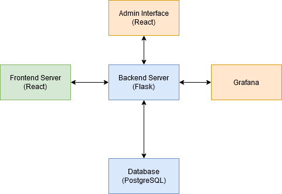

# Proiect IDP Istrate Luca, 341C3

---

## Idee proiect

Voi implementa o clona de [notion](notion.so). Aceasta este o aplicatie
de _all-in-one workspace_, permitand unui utilizator sa scrie text, sa-si
ia notite, sa-si creeze liste de TO-DO, calendare, remindere etc.

## Servicii

### Diagrama

### Database

O baza de data PostgreSQL pentru stocarea persistenta a datelor utilizatorilor.
Am ales aceasta baza datorita flexibilitatii acesteia, faptului ca este open-source
si suportului foarte bun pentru tipuri de date `JSON` si `hstore`.

### Backend

Backend-ul va fi implementat folosind Flask. Am ales Flask datorita modularitatii
bibliotecii si pentru ca imi place Python.

### Frontend

Frontend-ul va fi implementat in React. Am ales React pentru ca este unul dintre
cele mai folosite framework-uri pentru frontend in 2020. Aplicatia va fi un SPA
(Single Page Aplication), lucru pentru care React este potrivit.

### Admin site

Site-ul de administrate va fi implementat to in React, din aceleasi motive ca mai sus.

### Serviciu de monitorizare

Grafana va fi folosita pentru crearea unui serviciu de monitorizare.

## Link-uri proiect:

 - Github: [https://github.com/LOLsun/proiect-idp](https://github.com/LOLsun/proiect-idp)
 - Dockerhub: [https://hub.docker.com/repository/docker/lolsun/idp](https://hub.docker.com/repository/docker/lolsun/idp)
